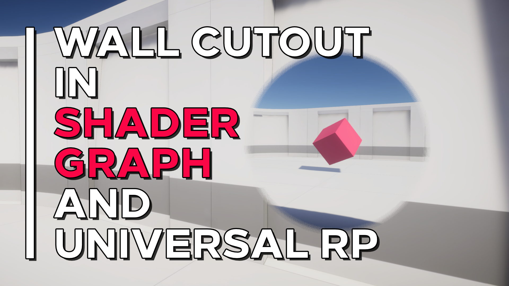

# Wall Cutout in Unity Shader Graph

A shader effect which cuts a hole in the wall to prevent an object being obstructed.

## Overview

Games often use tricks to see objects through walls. This example shader can be used to cut a hole in a wall (or any other object really) in oder to view a target object through it. It works by selecting a region on the wall and setting an alpha clip threshold, then reducing the alpha of that region to zero. For added detail, dithering is used on the edge of the region to blend the cut region.

## Software

This project was created using Unity 2020.2.1f1 and Universal Render Pipeline 10.2.2.

## Authors

This project and the corresponding tutorial was created by Daniel Ilett.

## Release

This project was publically released on February 15th 2021.
